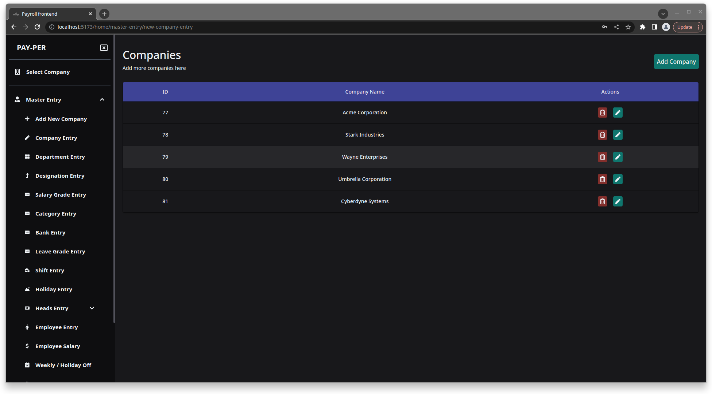

<h1 align="center">
  Payroll-System
</h1>

Payroll system made with React and Django

A comprehensive software application for managing employee payrolls. The system includes functionality for calculating employee salaries, processing payroll taxes, generating paychecks or direct deposits, and keeping track of employee attendance and leave.

