<h1 align="center">
  Payroll-System
</h1>

  
Payroll system made with React and Django

  
A comprehensive software application for managing employee payrolls. The system includes functionality for calculating employee salaries, processing payroll taxes, generating paychecks or direct deposits, and keeping track of employee attendance and leave.

  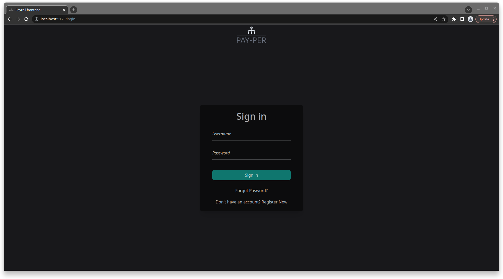

## Screenshots

### Login and Register Pages

  
  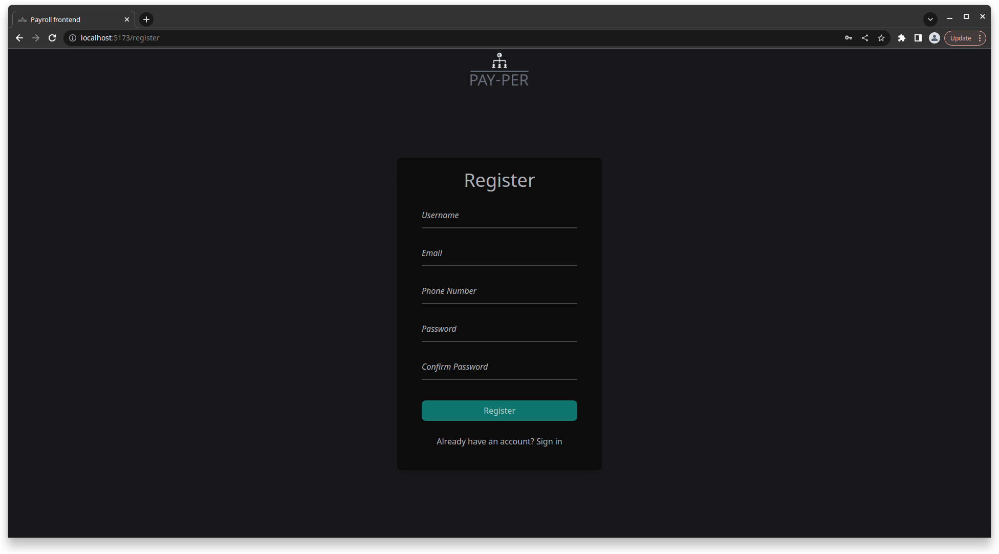

### Selecting Company

  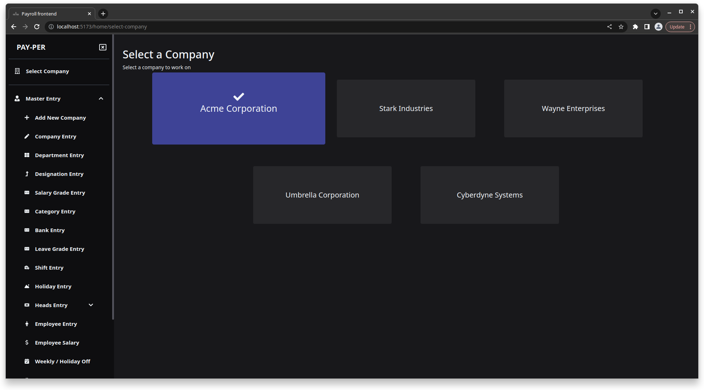

### Company Details

  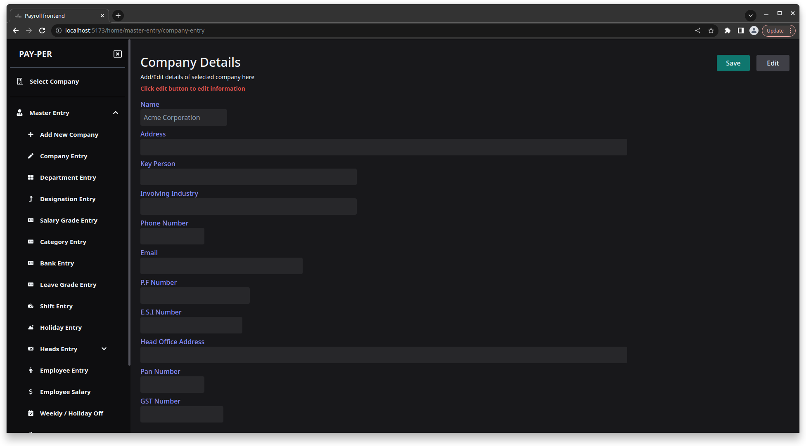

### Employee Management

  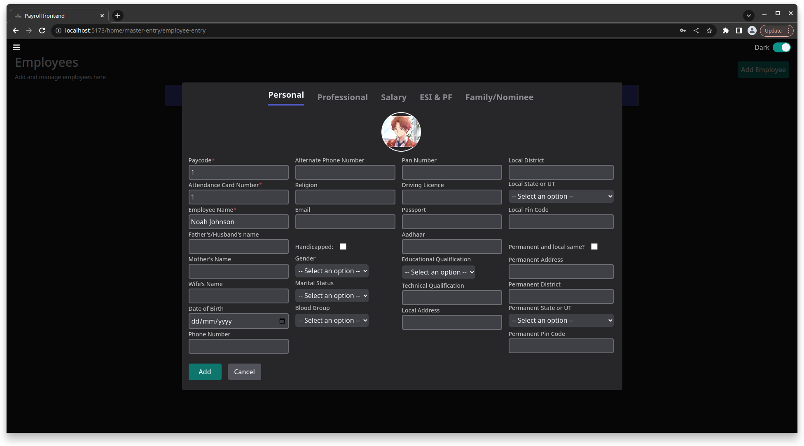
  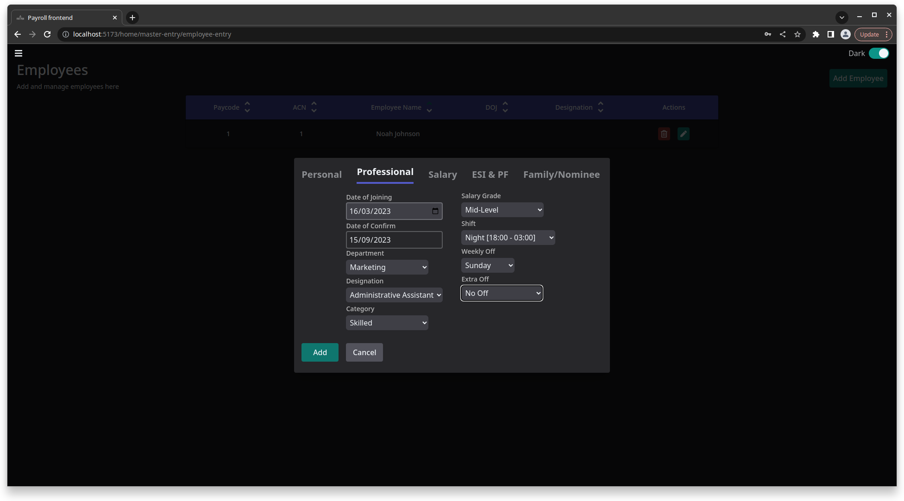
  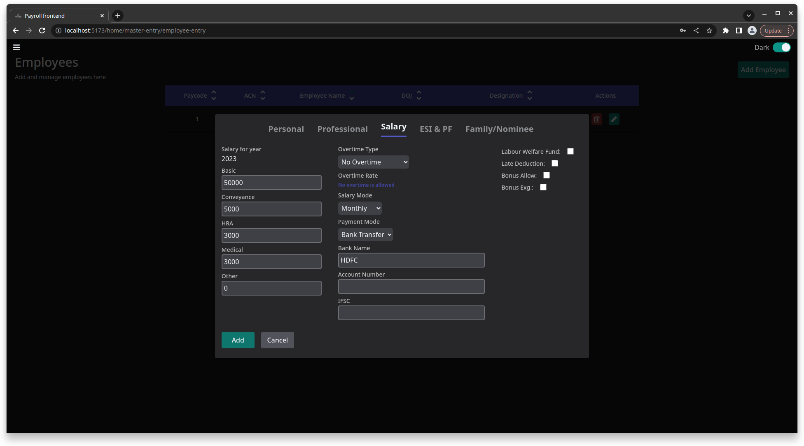
  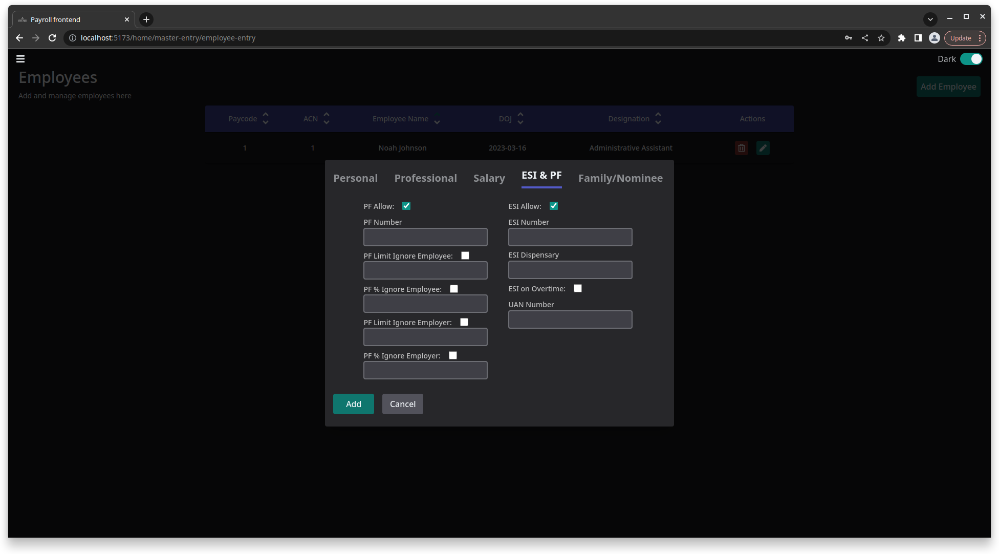
  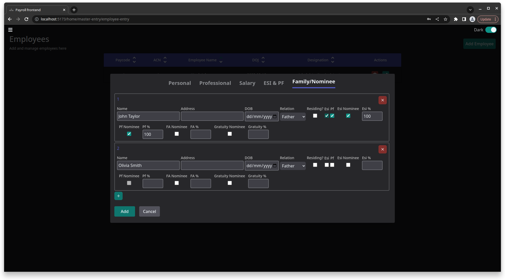
  <!-- Add more screenshots here -->

### Department and Shift Management

  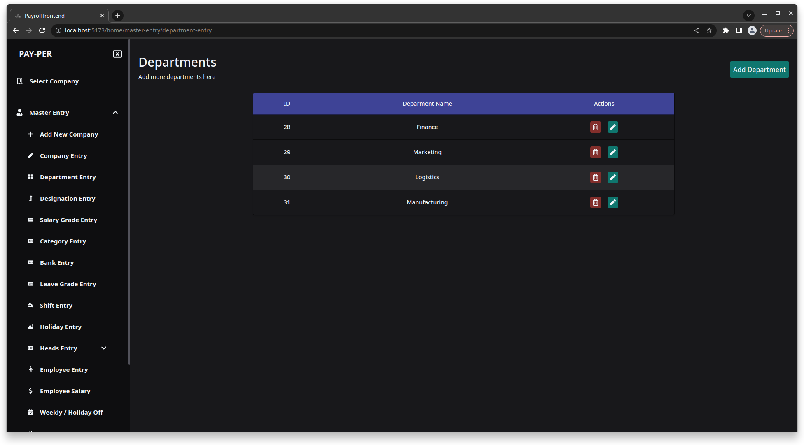
  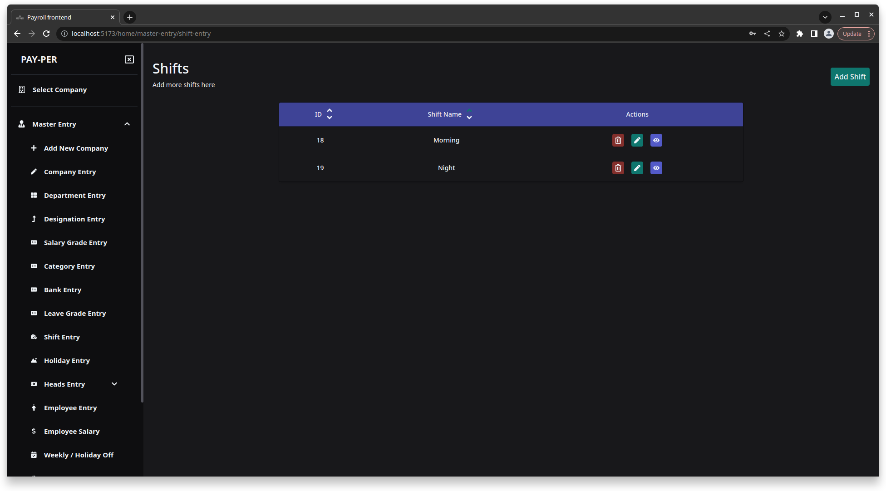
  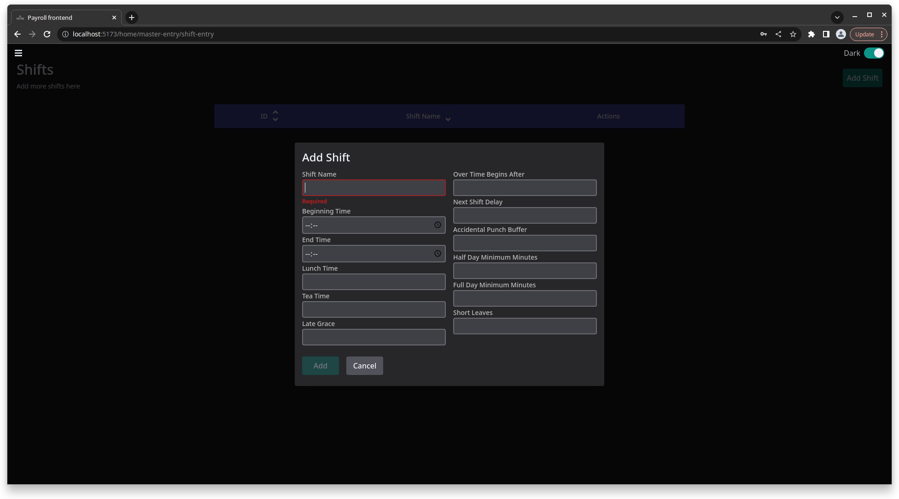
  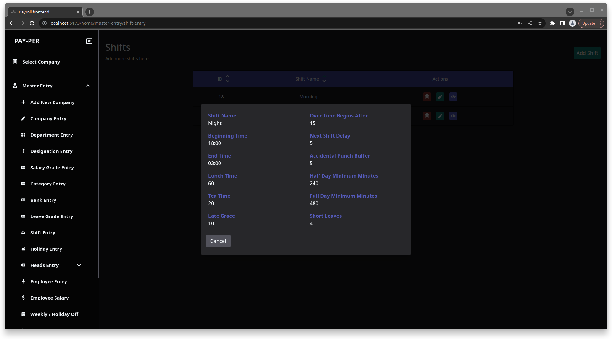

### Employee Shifts

  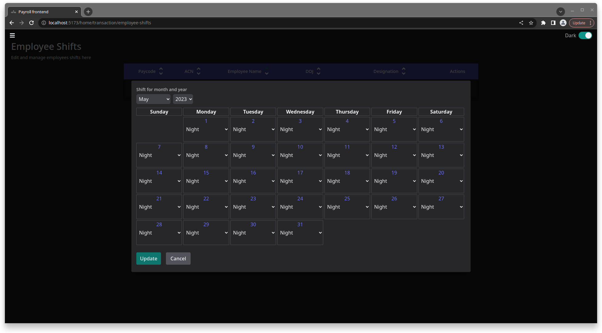

### Adding New Companies

  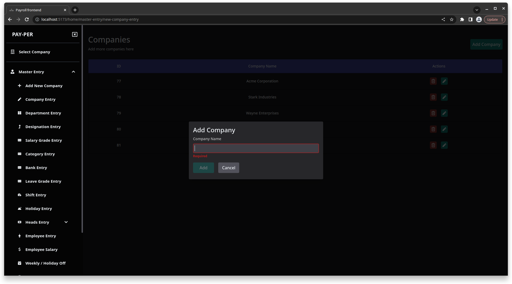

